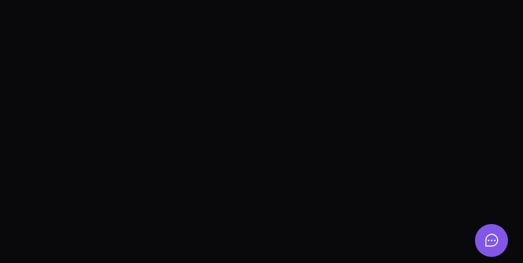
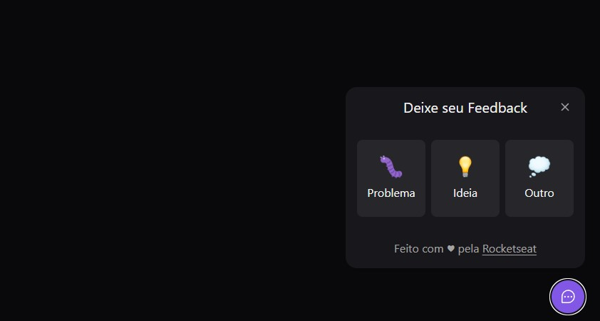
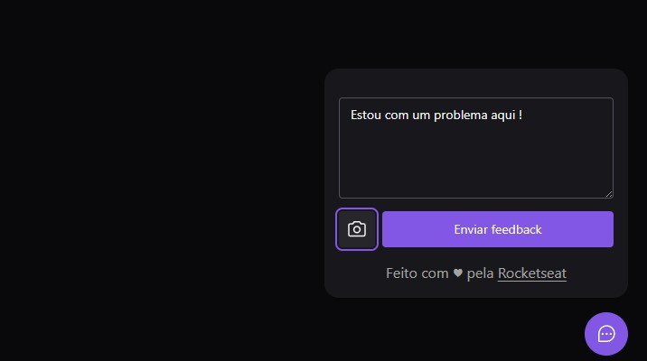

<h1 align="center">
   
</h1>

  

  

  

   
   
   
   

## Teste a aplicação aqui

https://nlw-return-impulse-blue-eta.vercel.app

## 🔧Técnologia

Esse projeto foi desenvolvido com as seguintes tecnologias:

### Principais Stacks:

- React
- React Native
- NodeJs
- PostgreSQL(BD em produção)
- Prisma

### Secunderias Stacks:

- Typescript
- Tailwind CSS
- Headless UI (Componentes com acessibilidade)
- Phosphor icon
- Insomnia(Testes de rotas)
- Jest(Teste unitários)
- Axios(Biblioteca/API para lidar com req HTTP)

## 🔖 Layout, prototipo e demonstração de como sera feito a aplicação

- Prototipo: https://www.figma.com/file/KpqZrTt8dBlk1k3osoFp2i/Feedback-Widget-(Community)?node-id=10%3A1638
- Demonstração Web: https://www.figma.com/proto/KpqZrTt8dBlk1k3osoFp2i/Feedback-Widget-(Community)?node-id=10%3A1722&scaling=min-zoom&page-id=10%3A1637&starting-point-node-id=10%3A1722
- Demonstração Mobile: https://www.figma.com/proto/KpqZrTt8dBlk1k3osoFp2i/Feedback-Widget-(Community)?node-id=113%3A2743&scaling=scale-down&page-id=10%3A1638&starting-point-node-id=113%3A2743

### Serviços usados:

- mailtrap.io(Envio de email em ambiente de desenvolvimento e produção) + nodemailer

## Executando o projeto local:

### Iniciar o Server

- <pre> npm run dev / yarn dev </pre>
- <pre> npm prisma studio / yarn prisma studio </pre>
- ### web
- <pre> npm run dev /  yarn dev </pre>

## ☕ Contatos

você vai me encontrar em qualquer uma das redes sociais abaixo:

